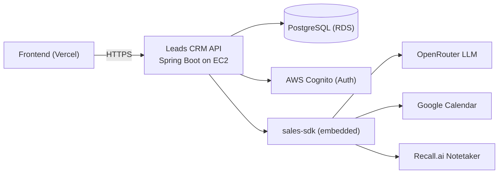

# Leads CRM API

Backend for the Leads CRM. Built by adapting Leadrat's existing services, not writing new ones
from scratch.

**Stack:** Spring Boot 4.1, Java 21, PostgreSQL, AWS Cognito. Also bundles `sales-sdk` for AI
search and meeting capture.

## What it does

- Leads, Projects, Channel Partners, Meetings
- User Management with two-layer RBAC (Cognito group + optional tenant custom role)
- Multi-tenant — every table is scoped by tenant automatically

## Architecture



## Run it locally

```bash
docker compose up -d
cp .env.example .env && set -a && source .env && set +a && ./mvnw spring-boot:run
```

- API: `http://localhost:8090/leads-crm`
- Docs: `http://localhost:8090/leads-crm/swagger-ui.html`

Needs a Cognito pool. Create one with:

```bash
ADMIN_EMAIL=you@company.com AWS_PROFILE=<profile> ./scripts/provision-cognito.sh
```

Without a pool, the app still starts and serves docs — authenticated requests just return 401.

## Authorization (RBAC)

Two layers:

1. **Cognito group** — the hard ceiling (Platform Admin/User, Tenant Admin/User).
2. **Custom role** — a tenant can only restrict permissions further, never add beyond the ceiling.

A user with no custom role gets the full ceiling for their group.

## Key decisions, short version

- No Flyway — Hibernate creates the schema on boot (`ddl-auto: update`).
- Soft deletes only — nothing is ever hard-deleted.
- Tenant seeding is lazy — a tenant gets its default data on first use, not at signup.
- `User.id` is the same value as the Cognito `sub` — no separate ID mapping to keep in sync.

## Deployment

See [DEPLOYMENT.md](DEPLOYMENT.md) for the full setup. Short version: GitHub Actions builds an
image, pushes it to ECR, and deploys it to one EC2 host over SSM.

## Production cost

Roughly **$30/month** at list price:

| Item | Cost |
|---|---|
| EC2 t3.small | ~$15 |
| RDS db.t4g.micro | ~$12 |
| EBS 20GB | ~$1.80 |
| Secrets Manager | ~$0.40 |
| ECR, SSM, IAM | free / pennies |

This does **not** include LLM usage — `sales-sdk`'s AI query and meeting features are billed
separately, per token, by OpenRouter. See Token usage below.

## Token usage (via sales-sdk)

Every AI query costs real money per token, on top of the AWS bill above. To keep it low:

- Keep `childDepth` / `parentDepth` small in query options — each extra level of relations sends
  much more data (and tokens) to the LLM.
- Use a cheaper model for routine questions; save larger models for genuinely complex ones.
- Don't expose fields the LLM never needs — mark them not-exposed/sensitive in the entity config.
- Cache repeated questions instead of re-asking the LLM the same thing.

## Known gaps

- Creating, disabling, or resetting a user needs real AWS Cognito credentials for the pool.
- No CloudFront/HTTPS in front of the API yet — see DEPLOYMENT.md.

## Verified

- `mvn compile` — clean.
- Boots against Docker Postgres; Hibernate creates the schema including RBAC tables.
- Unauthenticated requests to business endpoints return 401; docs and health stay public.
- `ControllerGuardCoverageTest` passes — every endpoint has exactly one permission guard.
- End-to-end locally: sign-in, tenant seeding, role/permission changes, and a disabled action
  still returning a real 403 from the backend, not just a hidden button.
